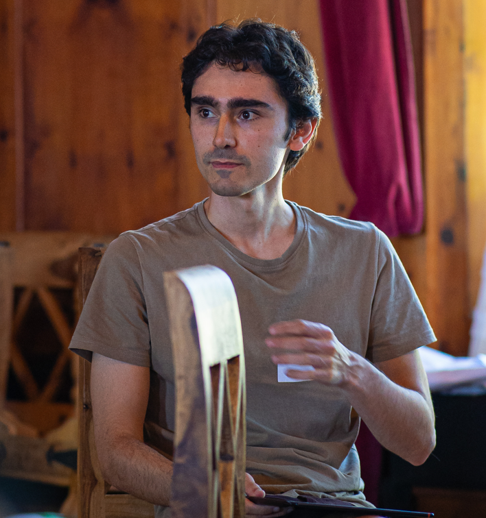

```{=html}
<style>
body {
  font-size: 20px;
}
h1 {
  font-size: 2.5em;
}
</style>

<style>
.section-card {
  background-color: transparent; 
  border: 1px solid #ddd;   
  border-radius: 20px;           /* Rounded corners */
  padding: 1.5em;                /* Inner spacing */
  margin-bottom: 1.5em;          /* Space between sections */
  box-shadow: 0 4px 10px rgba(0, 0, 0, 0.1); /* Soft shadow */
  transition: transform 0.2s, box-shadow 0.2s;
}

.section-card:hover {
  transform: translateY(-3px);
  box-shadow: 0 8px 20px rgba(0, 0, 0, 0.15);
}
</style>
<style>
.profile {
  text-align: center;
  padding: 1em;
}

.profile img {
  border-radius: 5%;
  width: 300px;
  margin-bottom: 1em;
  box-shadow: 0 3px 8px rgba(0,0,0,0.1);
}

.profile p {
  margin: 0.3em 0;
  font-size: 1em;
}
</style>

<style>
.center-text {
  text-align: justify;
}
</style>

<style>
.center-text {
  text-align: justify;
}

/* Icon container */
.links-grid {
  display: flex;
  justify-content: center;
  gap: 10px;
  margin-top: 6px;
}

/* Icon styles */
.links-grid img {
  width: 15px;
  height: 15px;
  opacity: 0.8;
  transition: opacity 0.2s ease, transform 0.2s ease;
  vertical-align: middle;
}

/* Hover effect */
.links-grid img:hover {
  opacity: 1;
  transform: scale(1.1);
}

/* Theme-specific visibility */
.icon-light { display: none; }
.icon-dark { display: inline; }

@media (prefers-color-scheme: dark) {
  .icon-dark { display: none; }
  .icon-light { display: inline; }
}
</style>


```

::::::::: grid
::: {.g-col-12 .g-col-md-3 .profile}
{width="489"}

📍 Geneva, Switzerland

✉️ celal.98\@outlook.com

Political economy, Political Science, Macroeconomics

:::

::: {.g-col-12 .g-col-md-9 .center-text style="border-radius: 30px;"}
# About me

My name is Celâl and I am a research-teaching assistant and PhD candidate at the University of Geneva. I specialize in the analysis of macroeconomic dynamics, socio-political expectations/preferences and political attitudes. I have a background in economics, political economy and economic history as well as in survey data analysis and statistical programming with R, SPSS and Stata. My field of interest concerns the analysis of institutional change of contemporary Western socio-economic models. I am also interested in the analysis of demand and productivity regimes from a post-Keynesian perspective; in the transformation of political cleavages; and in comparative politics/political economy.

:::

::: {.section-card .g-col-15 .g-col-md-12}
## 📚 Publications 

- GÜNEY, Celâl. Operationalizing Social Blocs: A Metaclustering Approach. In: Political economy working papers, 2026, n° 3, p. 23. <https://archive-ouverte.unige.ch/unige:193806>

- "AMABLE, Bruno, GÜNEY, Celâl. À la recherche des trois blocs : une analyse empirique de la tripolarisation de l’espace politique français. 2025"
    
     [https://archive-ouverte.unige.ch/unige:189320](https://archive-ouverte.unige.ch/unige:189320)

-   "The Political Economy of Institutional Change and Social Blocs in Switzerland: a Neorealist Approach"

    https://archive-ouverte.unige.ch/unige:176868 [link](https://jeylal.github.io/master-thesis/)


## 📌 Current Projects 

- "Low inflation in an island of high prices. The factors behind price stability in Switzerland"

-   "Demand and Productivity Regimes in Switzerland: 1950–2024"

-   "For a Neorealist Political Ecology. An Institutional Ecological Change Approach to Analyze the Socio-political Conditions for the Ecological Bifurcation" [draft 📄](resources_books/neorealist%20political%20ecology-2.pdf), [presentation at epita (ecological planning in the anthropocene)](resources_books/presentation_epita.html)

-   "Institutional Change in the Swiss Political Economy: Forces of Transformation and Stability"

:::


::: {.g-col-12 .g-col-md-5 .g-start-md-2 .section-card}
## 📖 Education

🎓 Bachelor in History-Economics-Society (now BA in Political Economy and Economic History) \| University of Geneva \| 2017-2020

🎓 Complementary Certificate in Applied Statistics \| University of Geneva (GSEM) \| 2021-2022

🎓 Master in The Political Economy of Capitalism \| University of Geneva \| 2022 - 2024
:::

::: {.g-col-12 .g-col-md-5 .section-card}
## 💼 Work Experience

🏫 Research and teaching auxiliary, department of History-Economics-Society, University of Geneva (August 2023 - January 2024)

🏫 Research and teaching assistant, department of History-Economics-Society, University of Geneva (August 2024 - July 2025)
:::

::: {.g-col-12 .g-col-md-5 .g-start-md-2 .section-card}
## 🌍 Languages

🇫🇷 **French** — Native  
🇬🇧 **English** — Very proficient  
🇪🇸 **Spanish** — Very proficient  
🇩🇪 **German** — Good knowledge  
:::

::: {.g-col-12 .g-col-md-5 .section-card}
## 💡 Interests

   Macroeconomics\
  Institutional economics\
 Political Science, comparative politics, cleavage politics
  Political economy and comparative capitalism\
 Survey data analysis \| Econometrics \| Statistics\
  Economic history \| History of economic thought\
:::
:::::::::

